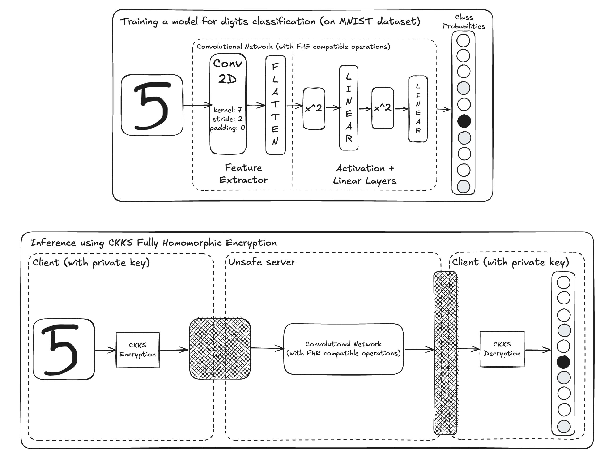

# MNIST Homomorphic Classification

---

## Architecture Overview



This repository implements a **privacy-preserving client-server architecture** for handwritten digit classification using the **CKKS Fully Homomorphic Encryption (FHE)** scheme. By ensuring end-to-end encryption, sensitive data (e.g., MNIST digits) remains fully encrypted during inference—even on untrusted servers—preventing exposure of raw inputs or results.
### Components
#### **Client-Side Workflow**
1. **Encryption**:  
   - Encrypts input (e.g., digit image "5") using CKKS.  
2. **Send to Server**:  
   - Transmits encrypted data for inference.  
3. **Decryption**:  
   - Decrypts encrypted class probabilities returned by the server.

#### **Server-Side Workflow**
1. **FHE-Compatible Inference**:  
   - Processes encrypted data through a convolutional neural network (CNN).  
2. **Return Encrypted Results**:  
   - Sends encrypted class probabilities back to the client.


### Security & Privacy
- **Client**: Holds private key; raw data never exposed.  
- **Server**: Operates only on ciphertexts; cannot infer inputs/outputs.
- This enables **secure AI** in sensitive domains (e.g., healthcare, finance) by ensuring data privacy during inference.

### Challenges
- **Speed**: FHE computations are slower than plaintext.  
- **Precision**: Approximate arithmetic may reduce model accuracy.  
- **Activation Limitations**: Polynomials approximate non-linear functions imperfectly.  


---

## CKKS Fully Homomorphic Encryption Scheme

**CKKS** (Cheon-Kim-Kim-Song) is a *homomorphic encryption* scheme that enables **approximate arithmetic** (addition/multiplication) on encrypted data. It’s ideal for privacy-preserving machine learning and secure data analysis.

### Steps in CKKS

#### 1. Encoding: Numbers → Polynomial
- **Input**: Vector of real numbers $[z_1, z_2, ..., z_n]$.
- **Scaling**: Multiply by $\Delta$ (e.g., $\Delta = 2^{40}$) to preserve precision:

$$
\mathbf{z}_{\text{scaled}} = \Delta \cdot \mathbf{z}
$$

- **Canonical Embedding**: Map the scaled vector to a polynomial in the ring $R = \mathbb{Z}[x]/(x^N + 1)$:

$$
m(x) = \sigma^{-1}(\mathbf{z}_{\text{scaled}})
$$

&nbsp;&nbsp;&nbsp;&nbsp;&nbsp;&nbsp;where $\sigma^{-1}$ is the inverse canonical embedding (similar to inverse DFT).

#### 2. Encryption: Polynomial → Ciphertext
- **Public Key**: $pk = (b, a)$, where $b = -a \cdot sk + e \ (\text{mod}\ q)$.  
- **Encrypt** $m(x)$ into ciphertext $ct = (c_0, c_1)$:

$$
\begin{align*}
c_0 &= v \cdot b + m + e_0 \ (\text{mod}\ q), \\
c_1 &= v \cdot a + e_1 \ (\text{mod}\ q),
\end{align*}
$$

&nbsp;&nbsp;&nbsp;&nbsp;&nbsp;&nbsp;where $v$ is random, and $e_0, e_1$ are small noise polynomials.

#### 3. Computation on Ciphertexts
##### Addition
$$
ct_{\text{sum}} = (c_0 + d_0, \ c_1 + d_1) \ (\text{mod}\ q)
$$

##### Multiplication
1. Compute tensor product:

$$
ct_{\text{mult}} = (c_0 \cdot d_0, \ c_0 \cdot d_1 + c-1 \cdot d_0, \ c_1 \cdot d_1) \ (\text{mod}\ q)
$$

2. **Relinearize** using $rlk$ to compress back to 2 components.

##### Rotation (Slot Shifting)
- Use **Galois keys** to rotate encoded slots (e.g., shift $[z_1, z_2, z_3]$ → $[z_3, z_1, z_2]$).

#### 4. Decryption: Ciphertext → Polynomial
- **Secret Key**: $sk$ (small random polynomial).
- Recover the (noisy) polynomial:

$$
m_{\text{decrypted}}(x) = c_0 + c_1 \cdot sk \ (\text{mod}\ q)
$$

#### 5. Decoding: Polynomial → Numbers

1. Apply canonical embedding:

$$
\mathbf{z} = \sigma(m_{\text{decrypted}}(x))
$$

2. Descale:

$$
\mathbf{z}_{\text{result}} \approx \mathbf{z} / \Delta
$$

### CKKS TenSeal Implementation
#### 1. Context

```python
import tenseal as ts

context = ts.context(
    ts.SCHEME_TYPE.CKKS,
    poly_modulus_degree=8192,        # Polynomial modulus degree (N)
    coeff_mod_bit_sizes=[60, 40, 40, 60]  # Coefficient modulus bit sizes
)
```

##### a) **`poly_modulus_degree`**
It defines the degree of the polynomial ring $R = \mathbb{Z}[x]/(x^N + 1)$.  
- **Slot Capacity**: Encodes $N/2$ numbers in parallel (e.g., $N=8192$ → 4096 slots).  
- **Typical Values**:  
  - $N=4096$: ~128-bit security (lightweight).  
  - $N=8192$: ~192-bit security (recommended for most use cases).  
  - $N=16384$: Higher security (slow, for critical applications).  

##### b) **`coeff_mod_bit_sizes`**
It specifies the bit sizes of primes in the coefficient modulus chain $Q = q_1 \cdot q_2 \cdot \dots \cdot q_L$.  
- **First Prime ($q_1$)**: Sets the scaling factor $\Delta \approx 2^{q_1}$ (e.g., $60$ → $\Delta \approx 2^{60}$).  
- **Middle Primes ($q_2, q_3, ...$)**: Manage noise growth during multiplications.  
- **Last Prime ($q_L$)**: Final modulus to control residual noise.  
- **Multiplicative Depth**:  
  - Chain length $L$ determines how many multiplications are allowed.  
  - Example: `[60, 40, 40, 60]` → $L=4$ primes → supports 3 multiplications (before noise overwhelms the message).
- **Note**: Total bit size of $Q$ (sum of `coeff_mod_bit_sizes`) must align with `poly_modulus_degree` for security.  

#### 2. Keys
| Key                             | Purpose                                   | Mathematical Role                         `                                             |
|---------------------------------|-------------------------------------------|----------------------------------------------------------------------------------------|
| **Secret Key** ($sk$)           | Decrypt ciphertexts                       | Small polynomial in $R = \mathbb{Z}[x]/(x^N + 1)$ used in $m = c_0 + c_1 \cdot sk$.    |
| **Public Key** ($pk$)           | Encrypt data                              | Pair $(b, a)$ where $b = -a \cdot sk + e \ (\text{mod}\ q)$.                           |
| **Relinearization Key** ($rlk$) | Compress ciphertexts after multiplication | Encodes $sk^2$ in a decomposed form: $rlk = (-a' \cdot sk + T \cdot sk^2 + e', \ a')$. |
| **Galois Key** ($gk$)           | Rotate slots or permute data              | Encodes automorphisms of $sk$ (e.g. rotations, row/column swaps).                      |
